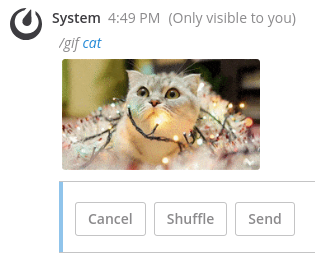

# Mattermost GIF commands plugin (ex-'GIPHY plugin') [](https://travis-ci.com/github/moussetc/mattermost-plugin-giphy)

**Maintainer:** [@moussetc](https://github.com/moussetc)

A Mattermost plugin to post GIFs from **Gfycat, Giphy or Tenor** with slash commands.

- Send a GIF directly with `/gif <keywords>`: 


- Choose a GIF privately before sending with `/gifs <keywords>`: 



## Compatibility
Use the following table to find the correct plugin version for each Mattermost server version:

| Mattermost server | Plugin release | Incompatibility |
| --- | --- | --- |
| 5.20 and higher | v1.2.x+ | breaking plugin manifest change |
| 5.12 to 5.19 | v1.1.x | breaking plugin API change |
| 5.10 to 5.11 | v1.0.x | buttons on ephemeral posts |
| 5.2 to 5.9 | v0.2.0 | |
| 4.6 to 5.1 | v0.1.x | |
| below | *not supported* |  plugins can't create slash commands |

## Installation and configuration

**In Mattermost 5.16 and later:**
1. In Mattermost, go to **Main Menu > Plugin Marketplace**.
2. Search for the "GIF Commands" plugin, then click **Install** to install it.
3. Once the installation is completed, click **Configure**. This will take you to System Console to configure the plugin.
4. Choose if you want to use Gfycat (default), GIPHY or Tenor (both of which requires an API key, see below).
5. **If you've chosen Giphy or Tenor, configure the API key** as explained on the configuration page.
6. You can also configure the following settings :
    - display style (non-collapsable embedded image or collapsable full URL preview)
    - rendition style (GIF size, quality, etc.)
    - rating (not available for Gfycat)
    - language (not available for Gfycat)
7. **Activate the plugin** in the `System Console > Plugins Management > Management` page

If you are running Mattermost 5.15 or earlier, or do not have the Plugin Marketplace enabled, follow these steps:
1. Go to the [Releases page](https://github.com/moussetc/mattermost-plugin-giphy/releases) and download the `.tar.gz` package. Supported platforms are: Linux x64, Windows x64, Darwin x64, FreeBSD x64.
2. Use the Mattermost `System Console > Plugins Management > Management` page to upload the `.tar.gz` package
3. Go to the `System Console > Plugins > GIF commands` and follow the same configuration steps as for the Marketplace install, displayed from Step 4. on the previous §.

### Configuration Notes in HA

If you are running Mattermost v5.11 or earlier in [High Availability mode](https://docs.mattermost.com/deployment/cluster.html), please review the following:

1. To install the plugin, [use these documented steps](https://docs.mattermost.com/administration/plugins.html#plugin-uploads-in-high-availability-mode)
2. Then, modify the config.json [using the standard doc steps](https://docs.mattermost.com/deployment/cluster.html#updating-configuration-changes-while-operating-continuously) to the following (check the [plugin.json](https://github.com/moussetc/mattermost-plugin-giphy/blob/master/plugin.json) file to see the lists of options for language, rating, rendition, etC.).

```json
 "PluginSettings": {
        // [...]
        "Plugins": {
            "com.github.moussetc.mattermost.plugin.giphy": {
		"displaymode": "embedded"
		"provider": "<giphy or gfycat or tenor>",
                "apikey": "<your API key from Step 4. above, if you've choosen Giphy or Tenor as your GIF provider>", 
                "language": "en",
                "rating": "",
                "rendition": "fixed_height_small",
		"renditiongfycat": "100pxGif",
		"renditiontenor": "mediumgif"
            },
        },
        "PluginStates": {
            // [...]
            "com.github.moussetc.mattermost.plugin.giphy": {
                "Enable": true
            },
        }
    }
```

## TROUBLESHOOTING

### I can't upload or activate the plugin 
- Is your plugin version compatible with your server version? Check the Compatibility section in the README.
- Make sure you have configured the SiteURL setting correctly in the Mattermost administration panel.
- Check the Mattermost logs (`yourURL/admin_console/logs`) for more detail on why the activation failed.

### Error 'Command with a trigger of `/gif` not found'
This happens when the plugin is not activated, see above section.

### Error 'Unable to get GIF URL'
Start by checking the Mattermost logs (`yourURL/admin_console/logs`) for more detail. Usual causes include:
- Using GIPHY as provider and using the public beta Giphy. The log will looks like: `{"level":"error", ... ,"msg":"Unable to get GIF URL", ... ,"method":"POST","err_where":"Giphy Plugin","http_code":400,"err_details":"Error HTTP status 429: 429 Unknown Error"}`. Solution: get your own GIPHY API key as the default one shouldn't be used in production.
- If your Mattermost server is behind a proxy:
  - If the proxy blocks Giphy, Tenor and Gfycat: there's no solution besides convincing your security department that accessing Giphy is business-critical.
  - If the proxy allows Giphy, Tenor and Gfycat: configure your Mattermost server to use your [outbound proxy](https://docs.mattermost.com/install/outbound-proxy.html).

### The picture doesn't load
- Your client (web client, desktop client, etc.) might be behind a proxy that blocks GIPHY, Tenor or Gfycat. Solution: activate the Mattermost [image proxy](https://docs.mattermost.com/administration/image-proxy.html).
- If the Display Mode configured is "Collapsable Image Preview", then the link previews option must be configured in the System Console (> Posts > Enable Link Previews). Do note that user can also change this option in their Account Settings. 

### There are no buttons on the shuffle message
- Check your Mattermost version with the compatibility list at the top of this page.

## Development
To build the plugin:
```
make
```
This will produce a single plugin file (with support for multiple architectures) for upload to your Mattermost server:
```
dist/com.example.my-plugin.tar.gz
```

There is a build target to automate deploying and enabling the plugin to your server, but it requires configuration and http to be installed:
```
export MM_SERVICESETTINGS_SITEURL=http://localhost:8065
export MM_ADMIN_USERNAME=admin
export MM_ADMIN_PASSWORD=password
make deploy
```
Alternatively, if you are running your mattermost-server out of a sibling directory by the same name, use the deploy target alone to unpack the files into the right directory. You will need to restart your server and manually enable your plugin.

## How do I share feedback on this plugin?

Feel free to create a GitHub issue or to contact me at `@cmousset` on the [community Mattermost instance](https://pre-release.mattermost.com/) to discuss.
